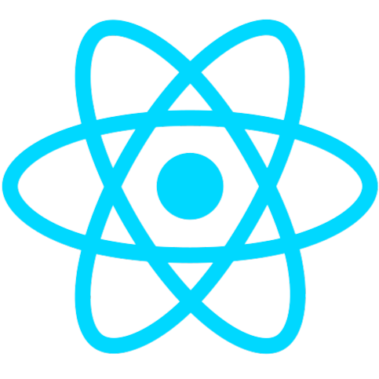

<p align="center">
  
</p>

<h1 align="center">✨ React ✨</h1>

<p align="center">To Do List</p>

</p>

## ⚠️ Envars

| env         | example     | description                  |
| ----------- | ----------- | ---------------------------- |
| NODE_ENV    | development | Current environment          |
| APP_VERSION | 1.0.0       | App version number           |
| PORT        | 4000        | Development port for the app |

## 🧑‍💻 Development

Clone the repository or use the template directly:

```bash
git clone https://github.com/A14Narriaga/template-react
```

Copy the environment variables from the example file:

```bash
cp .env.example .env
```

If the node_modules directory not already exist, create it

```bash
mkdir node_modules
```

If you want to run the application in development mode:
Note: Remeber execute all the commands for the repo directly form docker terminal.

```bash
docker compose up dev -d
```
